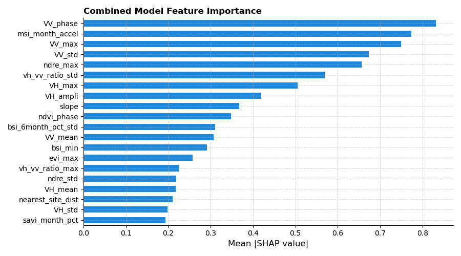

## **Challenge Objective**

- To use machine learning to predict croplands from non-croplands. 
- Aim is to develop accurate and cost-effective method for cropland mapping in two test regions (Fergana in Uzbekistan and Orenburg in Russia)

**Evaluation Metric:** Accuracy

## **Datasets used and sources**

The following datasets were extracted using Google Earth Engine. Date range in the provided test data was used except the sentinel-1 data for Orenburg where data from January 2018 to December 2022 (four years) was retrieved. This was due to no available data from January 2023 and above.

- Sentinel-1 (COPERNICUS/S1_GRD)
- Sentinel-2 (COPERNICUS/S2_SR_HARMONIZED)
- Climate data
  - Temperature (IDAHO_EPSCOR/TERRACLIMATE)
  - Land surface temperature (MODIS/061/MOD11A1)
  - Evapotranspiration (MODIS/061/MOD16A2)
- Digital elevation models (USGS/SRTMGL1_003). Slope and Elevation bands were extracted

The provided sentinel datasets weren't used because their distance with locations in the train shapefiles were far apart. Hence, the need to extract new datasets.

## **Methodology**

### **Data Preprocessing**

- Location IDs in the provided Sentinel 1 and 2 test data were aggregated into their monthly mean values.

- Merging of temperature, land surface and evapotranspiration datasets into one. Temperature data contained also information about the monthly precipitation, runoff, and soil temperature.

- Clustering coordinates in Fergana and Orenburg into four groups (optimal value). This was done separately since both regions are in different locations.

- Binning coordinates into grids of distance 50km.

- Generating sentinel indices. These include polarisation ratio, vegetative, water moisture, and bare-soil indices. These include: `NDVI`, `SAVI`, `EVI`, `NDWI`, `MSI`, `BSI` and `NDRE`. Similarly, the water stress index (WSI) was generated from the evapotranspiration data.

### **Feature Engineering**

Monthly Sentinel and climate datasets were aggregated and summarised for each location ID. These include:

- **Annual Aggregates:** Variables were summarised into annual aggregates such as the min, mean, max and standard deviation values. Aim is to capture long-term trends and variabiity in vegetation indices, polarization channels and climate variables. Croplands tend to show higher seasonal variability and distinct patterns compared to non-croplands due to planting activities.

- **Phenology statistics:** Due to the cyclical or periodic pattern in the datasets, harmonic linear regression was used to obtain the amplitude and phase of a variable. These harmonic components describe the strength/magnitude of the periodic pattern and the time it peaks. The aim was to understand the seasonal growth cycles of croplands and non-croplands as croplands tend to show predictable planting and harveting cycles unlike in non-croplands which often lack such pronounced cycles or different timing.

- **Rate of change per month and acceleration:** In addition to annual aggregates, the rate of change of a variable per month as well as the acceleration (rate of change of monthly difference) and also their percentage change. Here, a linear regression model was fit. This was engineered to quantify how quickly vegetation, bare soil, soil moisture or climate variables change over time and to detect abrupt transitions of these changes over time. Croplands undergo rapid changes during sowing and harvesting periods while non-croplands tend to not have pronounced phenomena.

- **Rolling statistics:** To account for the rate of change every 6-months, rolling average, sum and volatility in terms of standard deviation, of the rate of change were extracted. The purpose was to smooth short-term fluctuations and capture medium-term trends. This would help to identify sustained growth or decline phases, which are common in crop cycles but less so in non-croplands like pastures or steppes.

- **Distance-based features:** Distance to the nearest site for a given ID was computed. The average and standard deviations and the number of sites located within a 10km distance was computed. Croplands tend to cluster together. The proximity to other croplands increases the likelihood of a site being used for agricultural purposes. Hence, the reason why it was generated.

- **Grid-based aggregation:** Summary statistics of sentinel-2 and climate data for IDs located in a grid were also aggregated. These include: min, max, mean and standard deviations. This was aimed at capturing regional vegetative or climate patterns of sites located within a region/area.

- **Clustering:** Site coordinates for each region: Fergana and Orenburg was clustered. Using the elbow method, four clusters were obtained as optimal cluters for each of the regions of interest. Each cluster was one-hot encoded during preprocessing.

In general, these features collectively capture the following

- Temporal dynamics such as growth cycles and seasonal changes.
- Spatial structure by considering proximity to other croplands and regional patterns.
- Rate of change and volatility to identify abrupt transitions and sustained trends.
- Environmental characteristics of these sites by capturing variability, volatility and extremes of these climate and vegetation indices, including the vegetation moisture stress and soil exposure of croplands located in semi-arid regions.

### **Modelling**

Extracted features were prepared for modelling. Categorical features were one-hot encoded while numerical features were left as is since the models are not potentially affected by numerical scale ranges.

Three boosting models: _Catboost_, _XGBoost_ and _LightGBM_, were used and the mean values of their probabilities were averaged. Probabilities greater than 0.5 were assigned as 1 (cropland) and 0 (non-cropland), if otherwise.

**Feature Importance**

To understand the top features used by each model for distinguishing croplands from non-croplands, shap values were calculated and the absolute mean values for each input feature was aggregated and shap values for the top 20 features were presented in a bar chart. The same was done to their combined feature importance(Figure 1). 

From the results (not shown), the VV and VH polarisation channels, as well as their polarisation ratios, were amongst the top features. Others include vegetative indices such as Bare Soil Index (BSI), Normalized Difference Red Edge Index (NDRE), and Moisture Stress Index (MSI), and slope of the location. These highlight important properties that relate to semi-arid regions. Figure 1, shows the top 20 of their combined mean absolute shap values. Here, we see that the peak time, represented by phase, annual minimum or maximum values, and annual deviations, the magnitude of their periodic patterns, represented by the amplitude, are some features that distinguish croplands from non-croplands. Others include their rate of change (or percentage change) per month, the rate of change of monthly changes, (known as the acceleration), the variability of these changes (standard deviation) and the distance to the closest site.

 *Figure 1:* Combined Feature Importance

## **Instructions to run the code**

- data/
  - Sentinel1.csv
  - Sentinel2.csv
  - Fergana_training_samples.shp 
  - Orenburg_training_samples.shp
  - test.csv
- notebooks/
  - data_extraction.py
  - feature_engineering.py
  - cropland_modelling.py

The folder structure is as represented above. 

- Provided test sentinel data and the Fergana and Orenburg shapefiles are to be saved in the `data` folder.
- Python scripts saved in the `notebooks` folder
- Firstly, run the `data_extraction.py` file to download the sentinel data. These are saved in the `data` folder. However, it takes about 60 minutes to complete.
- Secondly, run the `feature_engineering.py` script to generate features. This takes about 5 minutes to complete.
- Thirdly, run the `cropland_modelling.py` script for modelling and prediction on the test data. This takes about 3 minutes to complete.

**Note**

- To save time, the `data_extraction.py` and `feature_engineering.py` scripts may be skipped as the datasets (`test_agg3.csv` and `train_agg3.csv`) used for modelling are in the `data` folder. The extracted sentinel and climate datasets are also in the `data` folder.
- The code was run on a machine with 8GB RAM and 4-core CPU.

