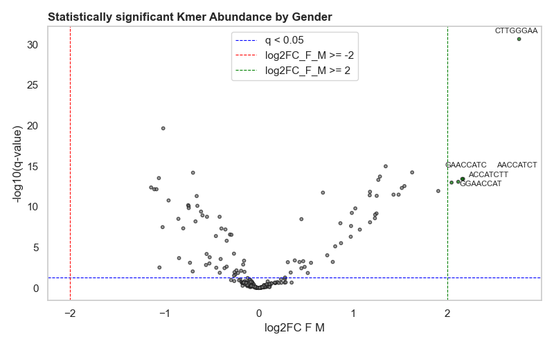
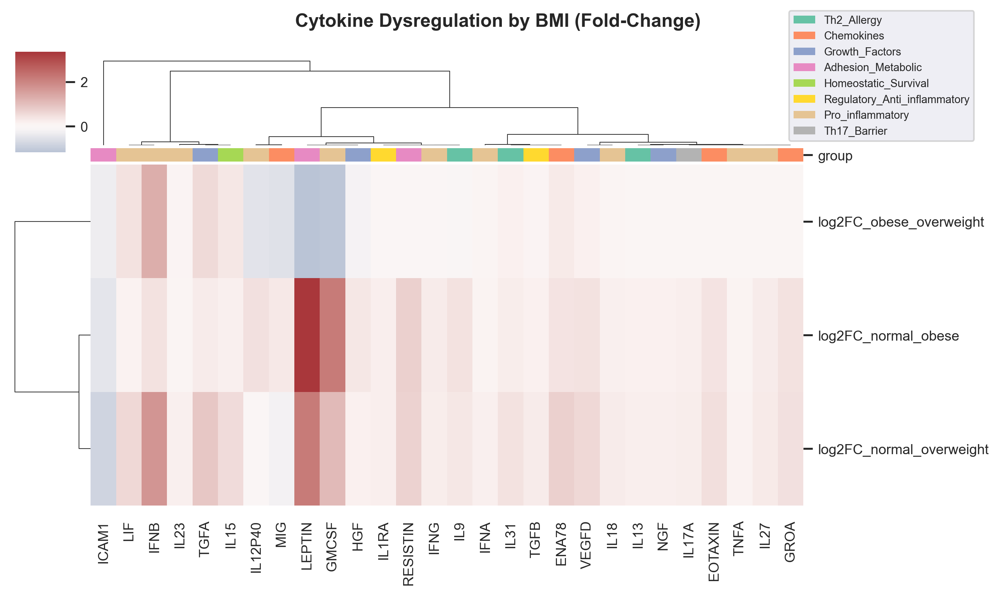
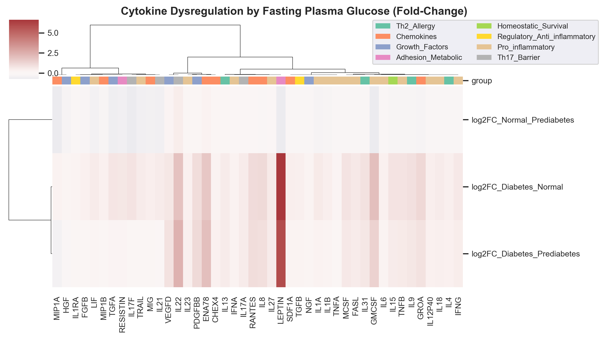
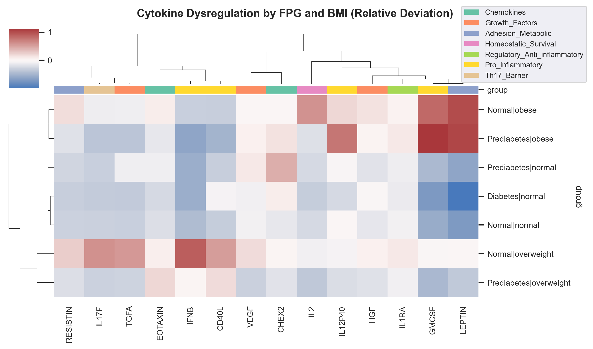
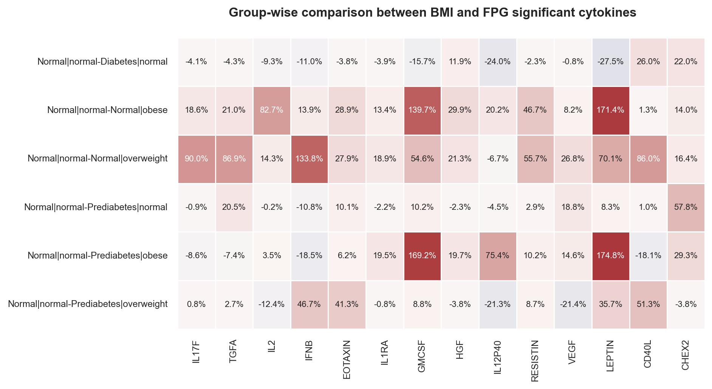

# **Introduction**
The microbiome is increasingly recognised as a key determinant of human health, playing central roles in modulating immune functions through interactions with host immune components necessary for immune development and protection [[1](#references)]. The composition of these microbial communities is highly dynamic and can be reshaped by factors such as lifestyle and dietary changes, infections, metabolic diseases, and aging [[2]](#references). Such perturbations are characterised by an imbalance in microbial diversity and the loss of beneficial taxa, which in turn disrupts the production of immunoregulatory metabolites such as short-chain fatty acids and tryptophan derivatives. These disruptions impair immune tolerance and barrier integrity, predisposing to chronic inflammation and immune-mediated diseases [[1, 2]](#references).

The human microbiome is distributed across multiple body sites of the host such as the gut, skin, mouth, and lungs, with distinct microbial communities existing in a body site based on the local environment of the site [[3]](#references). In this track, we aimed to identify microbiome-immune interactions in the host- how microbial composition and immune-molecule levels vary across demographic and metabolic factors. Key demographic and metabolic state variables included age and gender, and Body Mass Index (BMI) and Fasting Plasma Glucose (FPG), respectively. Analyses were kept at the body site level and at a global host system level.

# **Methodology**
## **Data Preparation**
Microbiome data obtained from 16S rRNA and stored in fastq files were cleaned and microbial composition was aggregated by dividing RNA sequences into 8-kmer sequences. The centered log-ratio (CLR) normalisation method was applied to normalise kmer counts to prevent sequence read length and depth bias. Furthermore, age and BMI variables wee converted into catgorical variables, where age was divided into four groups: Child (<18 years), Young (19-44 years), Middle-aged (45-59 years) and Senior (>=60 years) while BMI into normal, overweight, and obese.

Data cleaning and preparation steps can be summarised as below :-

- Removal of invalid bases (bases with Ns, if present)
- Removal of bases with low quality scores (below 20) and reads with sequence lengths less than 50
- Dividing into 8-kmer sequences, with no successive skips.
- Aggregating them into counts
- Selecting samples with matching cytokine levels.

## **Feature Selection**
To reduce the number of 8-kmer sequences obtained, feature selection methods were applied. Firstly, variance thresholding was applied to drop kmers with very low variance. Next, kmers (1,520) with non-zero coefficients for each cytokine, selected by an elastic-net linear model (in Track 1) were filtered. About 1492 kmers were selected. To further reduce this, the Spearman's correlation coefficient method was applied by correlating each kmer with each cytokine, and statistically significant ($\alpha$ < 0.05) kmers with |$\rho$| >= 0.25 were selected. Correlation method and the Spearman's correlation method were selected due to the non-linear relationship ability of the Spearman's correlation and under the assumption that a kmer that associates with a cytokine is capable of eliciting an immune response. Significant kmers were investigated at both the individual body site and across all body sites (system-wide), while significant kmers were selected by investigating kmers across all body sites leaving only 262 significant kmers. For system-wide analysis, CLR-normalised kmer counts were averaged across all body sites.

## **Dysregulation analysis by host factors**
This was done to identify abundance shifts in certain taxa sequences (in kmers) compared to healthy baselines and altered microbial influence on cytokines. Various parametric and non-parametric statistical tests were performed to identify significant kmers or cytokines at body site level and system-wide level, and by host factors. Significant kmers or cytokines were selected based on the p-value ($\alpha$ < 0.05) and effect size (depending on test). To identify differences between groups, fold changes between one group and the other were calculated. 

Post-Hoc test was also conducted to identify statistically significant group differences, while the false discovery rate of Benjamini and Hochberg (FDR-BH) p-value correction was used to reduce false positives due to multiple statistical tests. To identify interactions between host factors, the Two-way ANOVA statistical test was used. Additionally, to understand the group deviation from sample mean, the sample mean was subtracted from group means and normalised by the sample mean.

$$
\text{Relative Mean Deviation} = \frac{|\mu_{\text{group}} - \mu_{\text{sample}}|}{|\mu_{\text{sample}}|}
$$

## **Microbial Effects on Cytokines**
To identify how each microbe affects cytokine levels, a linear regression model was fit to model the magnitude and direction of a microbe's effect on cytokine levels while adjusting covariates and their interactions. Hence, the coefficient returned are individual microbe's effect on a cytokine after accounting for covariates and their interactions. Statistically significant 8-kmer sequences were individually fit on each cytokine at the body site and system-wide levels. Both the cytokines and kmers were standardised make individual effects be on comparable scale. Hence, the coefficients represent the normalised effect of a kmer on a cytokine.

Similarly, to control for false discovery rate, the FDR-BH method was applied with statistically significant coefficients with absolute values at least 0.1, were selected. Furthermore, the proportion of positive and negative coefficients at kmer and cytokine levels were obtained.

$$ 
\text{y} = \beta_0 + \beta_1 \text{kmer} + \beta_2 \text{Age} + \beta_3 \text{Gender} + \beta_4 \text{FPG} + \beta_5 \text{BMI} + \beta_6 (\text{Gender} \times \text{BMI}) + \beta_7 (\text{Age} \times \text{Gender}) + \beta_6 (\text{Age} \times \text{BMI})
$$

\newpage
# **Results**
## **Microbiome composition differ by body sites**
To test for difference in microbiome composition between body sites, the Kruskal-Wallis (KW) statistical test was used. All the selected kmers (as outlined in the feature selection section) used were statistically significant at a 5% significance level. Kmers were further filtered by their effect sizes, where kmers (231) with at least 0.3 effect size (U) were selected. However, to investigate group differences, the Dunn's multiple comparison test was performed. A summary of all group differences (Mouth-Skin, Mouth-Stool, Skin-Stool, Mouth-Nasal, Nasal-Skin, and Nasal-Stool) shows that 74.5% of kmers were significant at 6 of these combinations, 25.1% in about 5 combinations. Only one (< 1%) kmer in 4 combinations. 

**Table 1: Summary of the number of statistically significant kmers across body site groups**

|Number of groups| Total| Percentage|
|:---------------|-----:|----------:|
|6               |172   |74.5       |
|5               |58    |25.1       |
|4               |1     |0.4        |

To understand which body sites show similar patterns of microbial shifts, the fold changes in kmer abundance between body site pair were computed. It was discovered that microbial (kmer) compisitions between mouth-nasal and mouth-stool had over 70% kmers with at least 2-fold changes. Nasal-stool and nasal-skin with over 41%, with mouth-skin and skin-stool having less than 35%. The result shows that the microbial communities in the skin do not show distinct microbial dynamics with other body sites.

")

Figure 1 is a clustermap visualising site kmer compositions across body sites. By clustering based on the correlation between site-pair fold-change profiles, distinct groupings of body sites with shared microbial dynamics were revealed. From figure 1, we see a clear site-specific microbial composition. We see similar pattern in microbial composition between mouth-skin and skin-stool, nasal-skin and nasal-skin, and mouth-nasal and mouth-stool groups across all kmers.

## **Host-driven dysregulation of microbiome and immune profiles**
During healthy conditions, the microbiome and immune system maintain dynamic and equal states, however, this balance can be disrupted by the host's intrinsic factors such as demographics and metabolic states. Demographic variables such as age and gender, as well as metabolic states such as obesity and diabetes, affect microbial composition, hence we investigated immune system differences and microbial composition by gender, age, body mass index and fasting plasma glucose. Because these factors do not act in isolation, we further investigated how their interactions affect microbiome and immune profiles at different body site levels.

### **Demographics**
Out of the 670 participants, 389 were males, while 281 females. By age group, most of the participants are middle-aged (279) or seniors (292), with only 99 individuals below 45 years (young). For cytokine levels by gender, the Student's T-test was used while the KW-test for age groups was used. Furthermore, for microbial abundance by kmer composition, the ANOVA test was applied. We observed low to modest shifts in microbial and cytokine profiles by age and gender both at the body-site and system-wide levels. Only 50 unique kmer sequences were statistically different (p-adj < 0.05 and effect size >= 0.1) for age, while 54 for gender (p-adj < 0.05 and effect size >= 0.5). For cytokine levels, 24 cytokines were significant (effect size >= 0.06) for gender and 30 for age. 

To highlight large biological shifts between groups, absolute fold-changes up to 2 for microbial composition and 1.5 for cytokines were selected as cutoff. None of the cytokines showed significant changes (2.8 times) for age. `LEPTIN` significantly differs by gender, with average values 5,720 in females and 1,661 in males. In males, this cytokine is downregulated relative to the sample mean by 50.6% and upregulated in females by 70%, this represents a 120.1% increase in females compared to males. 

On the other hand, by comparing the microbial composition within age groups, only 14 kmers were at least 4 times dysregulated at the system-wide level while at the different body sites, none for skin, 1 for mouth, 7 for nasal and 6 for stool. It was further discovered that majority of these kmers were dysregulated in one or two groups. Similarly, for gender variable, only 5 kmers were at least 4 times dysregulated by gender in only nasal body site. A closer look shows that they are similar in sequence with the `ACCATC` sequence or are kmers from overlapping sequences (Figure 2). 

Leptin, an adipokine secreted by adipocytes, plays a role in modulating immune response, inflammation, and lipid/energy metabolism. It has been shown to differentially produced in women [[4]](#references). To understand its large differential in females than in males, we further grouped females by their age group and BMI category. Our result shows that leptin is dysregulated between groups. Obese females produce higher leptin levels than any other group, however, this is more in older obese and overweight females as well as in middle-aged obese women (Table 2).

**Table 2: Average Leptin levels in females by age and BMI groups**

|Age Group    |Normal  |Overweight|Obese   |
|:------------|-------:|---------:|-------:|
|Young        |1547.5  |2968.0    |5514.6  |
|Middle-Aged  |2471.5  |3656.7    |7304.   |
|Senior       |N/A     |6139.3    |7993.8  |
\newpage
### **Metabolic states**
To understand how different metabolic states of the host affect microbial distribution and composition as well as cytokine production, we further explored kmer and cytokine differences betweeen BMI and FPG categories.

**Body Mass Index**

To test the statistical significant difference between BMI groups for cytokine levels and kmer compositon, the KW-test was used. After applying FDR-BH pvalue correction method, 28 cytokines showed significant different between BMI groups ($\alpha$=0.05 and effect_size >= 0.06). Three cytokines: `LEPTIN`, `GMCSF` and `IFNB`, are upregulated in abnormal metabolic states (Figure 3). In normal weights, these three cytokines are downregulated relative to their overall mean values (Table 3). By comparing between groups, we see that in overweight individuals, `IFNB` is 114.8% more elevated than normal, and 17.1% more elevated in obese subjects. For `GMCSF`, it is 45.7% more elevated than normal in overweight individuals and 146% in obese individuals, while in overweight and obese persons, `LEPTIN` is more elevated than normal (69.3% and 180%, respectively). Obesity and overweight are characterised by increase in adipose cells which tend to lead to inflammation. In these conditions, fat cells release leptin to the brain to regulate energy balance. IFNB and GMCSF are inflammatory cytokines released by immnue cells to elicit inflammation [[4]](#references), hence the increased production in overweight patients could be because it is overexpressed at the onset of inflammation while other inflammatory cytokines like `GMCSF` are overexpresed in pathogenic/late inflammation.
\newpage
**Table 3: Relative mean for cytokines with 1.5-fold changes across BMI groups**

BMI group	|IFNB	|GMCSF | LEPTIN
:-------- |----:|-----:|-------:
normal	  |-0.50|-0.61 |-0.8
obese	    |-0.33|0.86	 |1.00
overweight|0.64	|-0.15 |-0.11

On the other hand, 47 kmers had at least 2-fold changes across all body site. By visualising a microbial kmer abundance shift in a clustermap (figures not shown), microbial communities, we see distinct microbe at body site levels. There are diverse and have a mixture of low and high abundant microbes between normal-overweight and normal-obese groups in the stool, with the population of some microbes decreasing or increasing during metabolic abnormality, respectively. In the nasal cavity, kmer population were decreased during abnormal metabolic state (overweight or obese)

Interestingly, the nasal microbiome exhibited the strongest kmer shifts in relation to BMI, with 30 kmers showing at least 2-fold changes. Seven were found in the skin, 8 in the stool and 2 in the mouth site. This may It has been found that dietary lifestyle can affect the nasal microbiota [[5]](#references).

\newpage
**Fasting Plasma Glucose**

Another metabolic state we investigated was fasting plasma glucose (FPG). Abnormal sugar level can be chronic if not checked or managed. As a result, we explored the role of FPG in cytokine production and microbiome distribution at body sites. The KW-test was performed to test significant cytokines ($\alpha$ = 0.05 and effect size >= 0.06) while ANOVA for site-specific significant kmers ($\alpha$ = 0.05 and effect size >= 0.2). Sixty-three (63) kmers were found to be significantly differ FPG levels in all sites, and 44 for cytokines. We filtered statistically significant kmers across all sites and cytokines based on their fold changes relative to one group pair. We identified 139 kmers with fold-change values at least 2 (~ 4 times) and four cytokines (`GMCSF`, `LEPTIN`, `IL22`, and `ENA78`) with at least 1.5-fold changes (Figure 4).

When we compare their relative mean values to overall mean, their normal values are upregulated. However, when we compare this (Table 4) with individual group pairs, using normal as reference group, we see that `GMCSF` levels is decreased in diabetic and prediabetic patients than normal by 92% and 45.8%, respectively. Similarly, `LEPTIN` is reduced in both abnormal groups, with 122% decrease in diabetic patients and 48.2% in prediabetic individuals. This is converse as seen in BMI indicating that `LEPTIN` and `GMCSF` cytokines are associated with fat metabolism. On the other hand, `IL22` and `ENA78` are downregulated in diabetic individuals and upregulated in prediabetic conditions compared to the normal conditions. The downregulation in diabetes could be attributed to other factors such as age and gender.

**Table 4: Percentage group changes for 1.5-fold cytokines in FPG**

Group pairs       |GMCSF	 |IL22	|LEPTIN	|ENA78
:---------------- |------:|-----:|------:|-----:
Normal-Diabetes   |-91.97 |-73.7 |-122.42|-73.21
Normal-Prediabetes|-45.83 |42.6  |-48.17 |21.96

Microbial composition of kmers with at least absolute 2-fold change values are shared between two body sites. For instance, 5 kmers each are found in stool and nasal sites and stool and mouth sites. Three between stool and skin and two between nasal and mouth. In the stool and nasal sites, these sequences are `ACGAGAAG`, `ACGGATGC`, `ATGGCTTA`, `ATTGATTA`, `GCTTTGCT`, while `GATAGTCT`, `GATTATTA`, `GGTTTCAG`, `GTTTCAGC`, `TTCAGCTT` in stool and mouth. kmers `ATTCTTCC`, `GTAAGCAT`, `GTCAGATG` sequences were significantly distributed in the stool and skin sites while `ATTCGGAA`, `CGCACTTT` in nasal and mouth sites. When we look at the sequences in all sites, we see that most of them have similar tetramers with point mutations. These tetra-kmers include `GCTT`, `GATT`, `GATA`, `CGGA`, `GGTT` and `GCAT`. These motifs may be similar to a microbial commnunity found in all body sites.

**Table 5: Body site specific FPG dysregulated kmers**

|            |Mouth | Nasal | Skin | Stool |
|:-----------|-----:|------:|-----:|------:|
|unique kmers|35    |46     | 11   |62     |

**Group Interactions**

To investigate if the effect of one factor depends on the level of the other, we performed a two-way ANOVA test (using the robust heteroskedasticity-consistent standard errors (HC3) method) where a significant interaction indicates that the difference between groups changes depending on the other variable. To do this, we test interactions between demographic variables (age vs gender), demographic variables and metabolic state variables (age vs bmi, age vs fpg, gender vs bmi and gender vs fpg) and between metabolic state variables (fpg vs bmi) at both cytokine and body site-specific kmer levels. A 5% significance level and effect size of 0.06 were selected as cutoff to indicate statistical significance. The effect size here refers to the fraction of the variance explained by the interaction term. Out findings show that for all tested pairs, there were significant interactions.

a. **Age vs Gender, BMI and FPG** 

Two-way ANOVA revealed significant cytokines whose regulation are different across age groups for males and females. These cytokines include `EOTAXIN`, `IL17A`, `RANTES`, `GMCSF`, `MCP1`, `VEGFD`, `PAI1`, `ENA78`. Twenty-eight cytokines were significant across age groups for each FPG category and 22 for each BMI category. These results tell us that the effect of age on these cytokines depends on FPG and BMI. To understand cytokines that are implicated across age groups in a combination of one or more interaction terms, we intersected their individual cytokine results. For gender and BMI across age groups, `EOTAXIN`,  `GMCSF`, `MCP1`, `VEGFD`, and `PAI1` were found to be similar in both groups. Similar cytokines were between gender and FPG, with the exception of `GMCSF` and `PAI1` and the addition of `ENA78` and `RANTES`. Next, we checked for similarities between FPG and BMI across age groups, and found that 14 unique cytokines amy be affected by age, and a combination of metabolic states. However, when we consider gender, we found out that 7 cytokines (`EOTAXIN`, `IL17A`, `RANTES`, `GMCSF`, `MCP1`, `VEGFD`, `PAI1`, `ENA78`) are affected by a combination of gender and metabolic states across all age groups.

On the other hand, we identified a similar pattern for kmers across sites. In age and gender, 79 kmers were identified to be affected by age and gender, 145 by age and FPG and 163 for age and BMI. For age and sex, no kmer was found to be affected in the skin, but a significant amount of kmers were found to may be heavily affected in the stool site across all tested interaction groups (Table 6). 

**Table 6: Number of unique kmers affected by age interactions by body sites.**

Body site |Age vs Gender| Age vs BMI| Age vs FPG|
:--------:|------------:|----------:|----------:|
Mouth     |22           |23         |30         |
Nasal     |2            |31         |58         |
Stool     |60           |122        |79         |
Skin      |0            |21         |4          |

Next, we conducted a pairwise-comparison to identify groups that are mostly affected by an interaction between age and another group. A combination of KW-test and pvale-corrections was applied. It was found that for normal and prediabetes FPG class, differences were found between middle-aged and senior, middle-aged and young and senior and young. While in middle-aged group, group differences were found in all combinations of categories in FPG class (normal-diabetes, etc), while for senior and young groups, differences were found in normal-prediabetes. For interaction between age and BMI, we found statistical significant differences in all group-pairs. For example, for each BMI group, differences were found in all age pair combinations. The same as in all age groups- differences between normal-obese, normal-overweight and obese-oerweight groups.

b. **Gender vs BMI and FPG**

Fewer than 10 cytokines are affected across gender and BMI or gender and FPG. Only 3 were found in gender and BMI and 8 in gender and FPG. All cytokines are unique in both interactions, for example, the three cytokines found to be affected by an interaction between gender and BMI are the `IL-2 and 5`, and `ICAM1`, while that for gender and FPG are `MIP1A`, `GMCSF`, `MCP1`, `VCAM1`, `PAI1`, `CHEX1`, `CHEX2`, and `CHEX3`. A similar pattern was observed in the respective body sites. The skin microbial population are not greatly affected by gender and BMI or FPG, however, microbial communities found in the stool and mouth sites are greatly affected by gender and FPG or BMI compared to the nasal site (Table 7). One major reason for this could be the difference in dietary and lifestyle patterns between males and females. In addition, across all sites, we found 253 and 90 system-wide kmers that are greatly affected by FPG and BMI in males and females, respectively.

**Table 7: Number of unique kmers affected by gender interactions by body sites.**

Body site |Gender vs FPG|Gender vs BMI|
:--------:|------------:|------------:|
Mouth     |201          |43           |
Nasal     |55           |9            |
Stool     |60           |48           |
Skin      |2            |0            |

c. **BMI vs FPG**

Here, we found 14 cytokines that are greatly affected by a combination of FPG and BMI (`IL17F`, `TGFA`, `IL2`, `IFNB`, `EOTAXIN`, `IL1RA`, `GMCSF`, `HGF`, `IL12P40`, `RESISTIN`, `VEGF`, `LEPTIN`, `CD40L`, `CHEX2`). A majority of these cytokines have been associated with BMI and FPG [[6,7]](#references). By computing their relative deviation from overall mean and coregulation clusters, and visualising in a clustermap, we see cytokines with similar deviation patterns. Additionally, when we compare these deviations with the FPG normal-BMI normal groups with other groups, we see upregulation patterns in BMI abnormal group combinations than in FPG group combinations (Figure 5). For example, FPG-normal vs BMI-overweight or obese individuals have higher values of `IFNB`, `GMCSF` and `LEPTIN` cytokines. This is rather different when you compare with FPG-diabetes and BMI-overweight individuals. This probably means that BMI abnormality greatly affects cytokine levels, and possibly microbial compositions even in the presence of sugar abnormality (Figure 6).

\newpage
## **Microbial Effects on Cytokines**
Under the assumption that the host's microbiome affect their immune system, and that microbial communities are distributed in different body sites, we decided to understand the individual effect of each of the microbe in the represented microbial community. We tested this at both the system-wide and body-site levels. However, because we established that cytokine regulation is affected by demographics and metabolic state of the host, as well as their interactions, we decided to adjust for effects of these covariates. Adjusted covariates and interactions include age group, BMI group, FPG group, gender, and the interactions between age and gender, age and bmi, and gender and bmi. To account for multiple testing, the FDR-BH p-value correction method was applied to the p-values. We further selected absolute normalised coefficients with at least 0.1 to understand the percentage of kmer signals that have positive or negative effects on cytokines at both the system-wide and body site levels. We further selected top 20 cytokines with the highest positive or negative effects for visualisation in a scatterplot. The size of each dot corresponds to the total positive and negative effects on a cytokine.

At the system-wide level (across all sites), `CHEX3` had the highest number of kmers that have positive effects (~31%) on it and about 15.6% for negative kmer signals. Others include `IL2`, and other interleukins like `IL5`, `IL8`, `IL9`, `IL1A`, and `IL21`, `RESISTIN`, `TRAIL`, `RANTES`, etc. It may indicate that these molecules play huge systemic roles in a host's immunity. It may also show that they are not confined to local body sites but circulate around the host's system to maintain immune regulation. It may also be that the kmers contributing to these effects encode microbes that are also not body-site specific and have conserved microbial sequences that are recognisable by these immune molecules [[1,2]](#references).

At the body site level, cytokines generally show a balanced distribution of positive and negative effects. Cytokines like `IL1A`, `TRAIL`, and `SDF1A` show relatively high percentages of both positive and negative effects and there's a positive correlation suggesting many cytokines are simultaneously affected positively and negatively by different kmer signals. In the nasal site, cytokines have lower percentages of both positive and negative effects compared to stool. `VEGF` has notably higher positive effect percentage but low negative effect. Cytokines like `IL5`, `IL2` and `IL1A` show moderate positive and negative effects. Additionally, the number of kmers affecting cytokines in the mouth is generally lower than stool, but some cytokines such as `VEGF` and `IL17A` show high positive effects with few negative effects. Most other cytokines cluster towards lower positive and negative effect percentages. Finally, in the skin, cytokines show a different pattern with some cytokines like `PAI1` and `CHEX3` having high positive effects with low negative effects. `RESISTIN`, `CHEX1`, `IL17A`, `IFNG`, and `TGFA` have higher negative effects but low positive effects (Figure 8). These results further show that different body sites exhibit distinct patterns of how kmer signals affect cytokines.

\newpage
# **Conclusion**
Here, we investigated the dysregulation of cytokines and microbial composition, represented as kmer sequences, are affected by demographics and metabolic state of the host. We identified that microbial distribution across site differ greatly and that interactions between demographics and metabolic states do have effects on cytokine levels. Finally, we explored the individual effects of each kmer on cytokines after adjusting for covariates and their interactions. By representing the percentage positive and negative kmer signal effects, we discovered a site-related pattern in modulating cytokine production. These results highlight the complexity and specificity of microbiome-immune interactions which are dependent on key host characteristics and metabolic states.

# **References**

[1] Kim, S., Ndwandwe, C., Devotta, H., Kareem, L., Yao, L., & O’Mahony, L. (2025). Role of the microbiome in regulation of the immune system. Allergology International, 74(2), 187-196. https://doi.org/10.1016/j.alit.2024.12.006

[2] Zeng, J., He, Z., Wang, G., Ma, Y., & Zhang, F. (2025). Interaction Between Microbiota and Immunity: Molecular Mechanisms, Biological Functions, Diseases, and New Therapeutic Opportunities. MedComm, 6(7), e70265. https://doi.org/10.1002/mco2.70265

[3] Kennedy, M. S., & Chang, E. B. (2020). The microbiome: Composition and locations. Progress in Molecular Biology and Translational Science, 176, 1. https://doi.org/10.1016/bs.pmbts.2020.08.013

[4] Stefanakis, K., Upadhyay, J., Ramirez-Cisneros, A., Patel, N., Sahai, A., & Mantzoros, C. S. (2024). Leptin physiology and pathophysiology in energy homeostasis, immune function, neuroendocrine regulation and bone health. Metabolism, 161, 156056. https://doi.org/10.1016/j.metabol.2024.156056

[5] Cárdenas, J. P., González, D., Puebla, C., & Fuenzalida, L. F. (2023). Microbiota Profile of the Nasal Cavity According to Lifestyles in Healthy Adults in Santiago, Chile. Microorganisms, 11(7), 1635. https://doi.org/10.3390/microorganisms11071635

[6] Yang, M., Shangguan, Q., Xie, G., Sheng, G., & Yang, J. (2025). The U-shaped association of fasting plasma glucose to HbA1c ratio with mortality in diabetic and prediabetic populations: The mediating role of systemic immune-inflammation index. Frontiers in Endocrinology, 16, 1465242. https://doi.org/10.3389/fendo.2025.1465242

[7] Khathlan, N. A. (2023). Association of inflammatory cytokines with obesity and pulmonary function testing. PLOS ONE, 18(11), e0294592. https://doi.org/10.1371/journal.pone.0294592