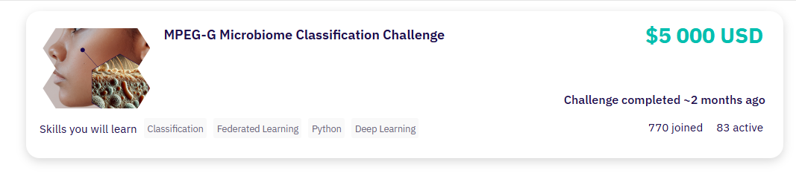

## **MPEG Microbiome Classification Challenge**

Repository to the 6th place solution to the [MPEG Microbiome Classification Challenge](https://zindi.africa/competitions/mpeg-g-microbiome-classification-challenge) hosted on Zindi.

## **Challenge Objective**

- To use centralised and federated learning machine learning approach to predict where in the body a microbiome sample comes from, based on their metagenomic data, by classifying samples into stool, oral, skin, or nasal, using its 16S rRNA gene sequence. 

**Evaluation Metric**

- Log Loss

## **Methodology**

The fastq files from the decompressed MPEG-G format files, hosted on Kaggle, by [@MuhammadQasimShabbeer](https://zindi.africa/users/MuhammadQasimShabbeer) was used for this challenge. 

### **Data Preprocessing**

**Data cleaning**

- Removal of incorrect bases (bases with Ns, if present)
- Removal of bases with low quality scores (below 20) and reads with sequence lengths less than 50
- Generation of 8-kmer sequences, with no successive skips.
- Aggregation into counts

**Feature Selection (Used in Method 2)**

- Variance thresholding: Removal of kmers with variances below a cutoff.
- Selection of canonical kmers: Selecting one kmer if its reverse complement is present. Here, a kmer is assumed to be the same (have similar property) as its reverse complement.

**Feature Engineering**

- Kmer counts were transposed with samples as rows and kmers as columns.
- *Normalisation*: To prevent sample bias due to read length and depth, I normalised counts using the centred-log ratio method (CLR).
- *Dimensionality Reduction*: 
    - Method 1: Autoencoder with 64 embedding size (Used in competition)
    - Method 2: Partial Least Squares with 15 latent features.

- Embeddings were further scaled and fed into the model network.

Centered Log-Ratio:

$$
\text{CLR} = \log(1 + \text{counts}) - \text{mean}(\log(1 + \text{counts}))
$$

## **Modelling**

### **Model Architecture**

- A three-layer fully connected layer (PyTorch) with 192 neurons at the first layer with RMSProp optimiser and crossentropy loss with learning rate at 5e-4. Each dense layer had a 1-D batch-norm layer (Used in competition).

- A logistic regression model (Pytorch) with SGD optimiser and crossentropy loss with 0.1 learning rate (Method 2).

## **Federated Learning**

This focuses on training models across multiple decentralised devices or nodes without the need to transfer the data to a central server (AI Generated). Federated learning was implemented from scratch with the help of Microsoft Copilot and also with the concept as described in the `Flower` package for [federated learning](https://flower.ai/docs/framework/tutorial-series-what-is-federated-learning.html).

**Setup**

- To maintain "privacy" of clients, data splitting was done to ensure that samples belonging to one subject are in one client alone.

-  Each client is set up and instantiated with the parameters from the global model which stays on the server.

- Each client has similar configuration setting provided as Python dictionaries, with some allowed keys.

- The server where the global model resides aggregates parameter updates from each client in the network.

- Aggregation is done using ***Federation Averaging*** strategy by computing the weighted sum of their parameters in each round. The weights come from their respective sample sizes.

- After aggregation, the global model updates its parameters from here and sends back this update to all the clients for the next round.

- Because, scaling will be done by each client, a standard scaler object was temporarily fit on the training samples from the first client. After that, all clients send back their summary statistics (mean and variance) to the server, where they are aggregated using the same idea as described in weight parameter update (weighted sum).

- After this is done, the server updates the global model with this new information and then sends back to the clients which update their scaling parameters with this new information.

- Validation evaluation is done at both client and server levels, where each client evaluates their validation data with their respective parameters and sends back to the server, which further computes a weighted sum (validation sample size). At the server level, all clients (or some, based on what is in the server configuration), send their temporarily sends their validation data to the server for evaluation using the updated parameters of the global model.

- Finally, testing is done only at the server level using the updates of the global model. This is to ensure global model's learning.

- Depending on the server configuration, not all clients are selected for training and validation. All clients for training and validation are randomly selected (some can be used in either one or two of the training and validation round).

## **Results**

Model   | Centralised model | Federated Learning
:-------|------------------:|-------------------:
Method 1|   0.03864863      |   0.065552911
Method 2|   0.00516857      |   0.005536653